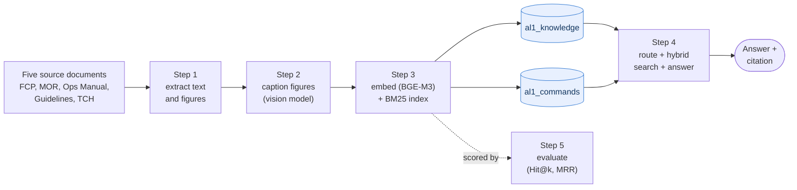

# Aditya-L1 Mission Document Assistant

This is a question-answering tool I built over the operations documents of ISRO's
Aditya-L1 mission. You ask it something in ordinary English and it answers from the
actual mission paperwork, and tells you where the answer came from. It runs
completely offline on a single machine, which was a hard requirement for me:
the documents are confidential, so nothing can be sent to a cloud service.

A few things it handles well:

- "What is the procedure for switching on OBC?" gives back the step-by-step
  commands from the flight control procedures.
- "What commands were uplinked on 2026-06-09?" returns the full list from the
  telecommand history.
- "Show me the MRS recovery flow diagram" finds the figure and displays it.

## The idea behind it

The approach is Retrieval-Augmented Generation (RAG). A plain language model
doesn't know anything about Aditya-L1, and if you ask it anyway it will happily
invent a confident-sounding answer. So rather than trusting the model's memory, I
keep the documents in a search index, pull out the passages that actually match
your question, and hand only those to the model to write the reply. The model
ends up being a competent writer working from the correct source material,
instead of a know-it-all guessing.

## How the pipeline is put together

The project runs in four steps, with a fifth that measures how good the retrieval
is:



Step 1 pulls the text and figures out of all five documents. They come in
different formats, so each one needed a different reader: PyMuPDF for the two
PDFs, python-docx for the Word file, LibreOffice to convert the old `.doc`
guidelines first, and some regex to parse the telecommand log, which is really
just a large pipe-separated table.

Step 2 handles the diagrams. A block diagram or flow chart is invisible to a text
search unless you describe it, so I send every figure to a local vision model
(Qwen2.5-VL, running under Ollama) and it writes a caption. Those captions get
indexed like any other text, and that's how asking for the "MRS recovery flow
diagram" actually finds the picture.

Step 3 turns everything into vectors using the BGE-M3 embedding model and stores
them in ChromaDB, next to a BM25 keyword index. I split the store into two
collections, which I'll come back to below.

Step 4 is the part you talk to. It first works out whether your question is about
the command log or about everything else, then runs a meaning-based search and a
keyword search together, combines the two rankings, and finally either writes an
answer with the local model or, for command and diagram questions, shows you the
table or the figure directly.

## Why there are two collections

Keeping the store split in two was a deliberate decision, and it comes up a lot
when I explain the design. The procedures, guidelines and captions are prose that
you search by meaning: "how do I switch on OBC" has no exact keyword to latch
onto, you need to find the passage that means the same thing. The telecommand log
is the opposite. "What was uplinked on 2026-06-09" isn't a meaning question at
all, it's a database-style filter that should return every matching row as a
table. Mixing the two would let the short, repetitive log entries pollute the
procedure answers, and vice versa, so `al1_knowledge` and `al1_commands` live
apart and each gets searched in the way that suits it.

## Setup

Install the Python packages:

```bash
pip install -r requirements.txt
```

You also need three tools that aren't Python packages: Ollama (to run the models
locally), LibreOffice (step 1 uses it to convert the `.doc` guidelines), and
ImageMagick (step 1 uses it to turn the WMF/EMF figures into PNGs). Then pull the
two models:

```bash
ollama pull qwen2.5vl            # vision model, for captioning figures
ollama pull qwen2.5:7b-instruct  # text model, for writing answers
```

The embedding model (BGE-M3, about 2.3 GB) downloads by itself the first time you
run step 3. It'll run on CPU if you don't have a CUDA build of PyTorch, just more
slowly.

## Running it

The four steps run in order, from the project folder:

```bash
python step1_extraction.py .
python step2_image_captioning.py
python step3_build_vectorstore.py --reset
python step4_query.py "What is the procedure for switching on OBC?"
```

`step4_query.py` also has an interactive mode if you run it with no question, an
`--open` flag to pop up any diagrams it finds, and a `--subsystem` filter. There's
a Streamlit web version too:

```bash
streamlit run app.py
```

And to check retrieval quality:

```bash
python evaluate.py --html --json
```

## How well it works

I wrote a small evaluation harness because "it looked right when I tried it" isn't
something you can put in a thesis. It runs a set of questions where I already know
which document holds the answer, and checks whether retrieval brings that document
back and how high it ranks. On the current 15-question set:

| Metric | Score |
|--------|-------|
| Hit@1  | 93.3% |
| Hit@3  | 100%  |
| Hit@5  | 100%  |
| MRR    | 0.967 |

Hit@k is the fraction of questions where a correct chunk showed up in the top k
results, and MRR (mean reciprocal rank) captures how high the first correct one
sat on average. The one question that isn't rank 1 is a "SUIT ON" versus "SUIT
OFF" mix-up, two procedure titles that differ by a single word, which is a known
weak spot for this kind of search and a fair thing to note honestly.

## A couple of design choices worth explaining

Everything is local because the data is sensitive, so the embeddings, the vector
database and the answer generation all run on the machine with no external API in
the loop anywhere.

The search is hybrid, meaning it runs a semantic (vector) search and a BM25
keyword search side by side and merges them. I did that because these documents
are full of exact identifiers like `OBCS2370` and `FCP-5201`. Pure semantic search
blurs those, while keyword search nails them, so using both covers each other's
blind spots. The two rankings get combined with Reciprocal Rank Fusion.


## What's in the repo

```
step1_extraction.py          extract the 5 documents into chunks, commands, images
step2_image_captioning.py    caption the figures with Qwen2.5-VL
step3_build_vectorstore.py   embed everything and build the two collections + BM25
step4_query.py               the query engine (routing, hybrid search, answers)
app.py                       Streamlit web interface
evaluate.py                  retrieval evaluation (Hit@k, MRR)
requirements.txt             Python dependencies
extracted/                   step 1 and 2 output
vectorstore/                 the ChromaDB store and BM25 indexes
```
